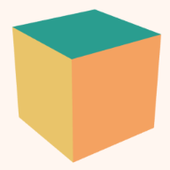
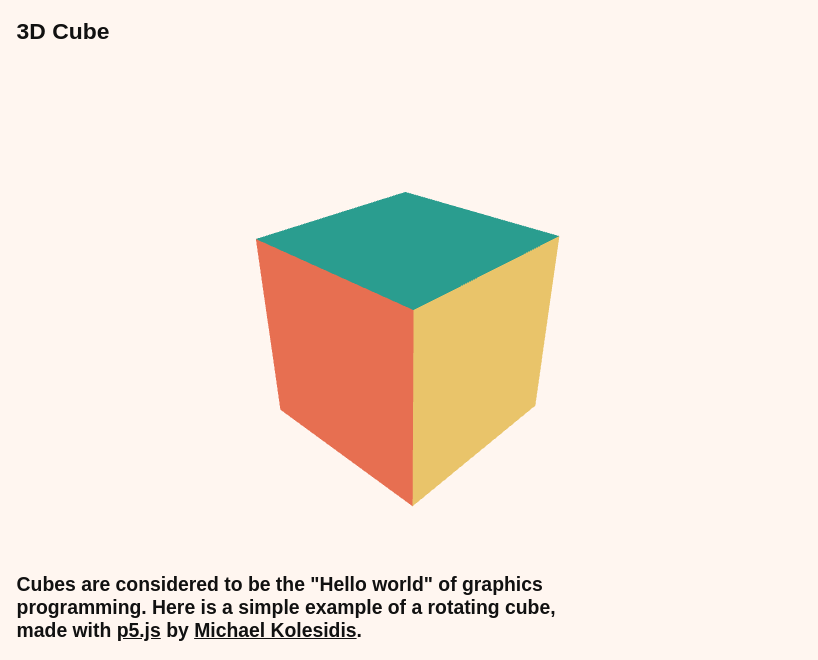

  
  <h1>3D Cube</h1>
  
  <h3>A 3D cube rotating according to mouse movement. </h3>

<a href="https://3d-cubejs.netlify.app/"><h3>Try me!</h3></a>

  
## Technologies Used

&nbsp;&nbsp;&nbsp;&nbsp;&nbsp;&nbsp;

&nbsp;&nbsp;&nbsp;&nbsp;&nbsp;&nbsp;

&nbsp;&nbsp;&nbsp;&nbsp;&nbsp;&nbsp;

&nbsp;&nbsp;&nbsp;&nbsp;&nbsp;&nbsp;

## Description

One of the first projects I ever created when I started learning JavaScript. Originally, I created it using [Processing](https://processing.org/), and then I ported it to the web using Processing's JavaScript sibling, p5.js.

A colorful three-dimensional cube that rotates according to the movement of the mouse inside the window. Double-click anywhere to enter fullscreen mode, double-click again (or press ESC) to leave fullscreen mode.

## Screenshot

## Related Projects

- [3D Teddy Bear](https://github.com/michaelkolesidis/3d-teddy-bear)
- [Circle Random Lines](https://github.com/michaelkolesidis/circle-random-lines)
- [3D Cube (Processing)](https://github.com/michaelkolesidis/3d-cube-processing)

## License

Copyright (c) 2023 Michael Kolesidis 
Licensed under the [GNU Affero General Public License v3.0](https://www.gnu.org/licenses/agpl-3.0.html).
